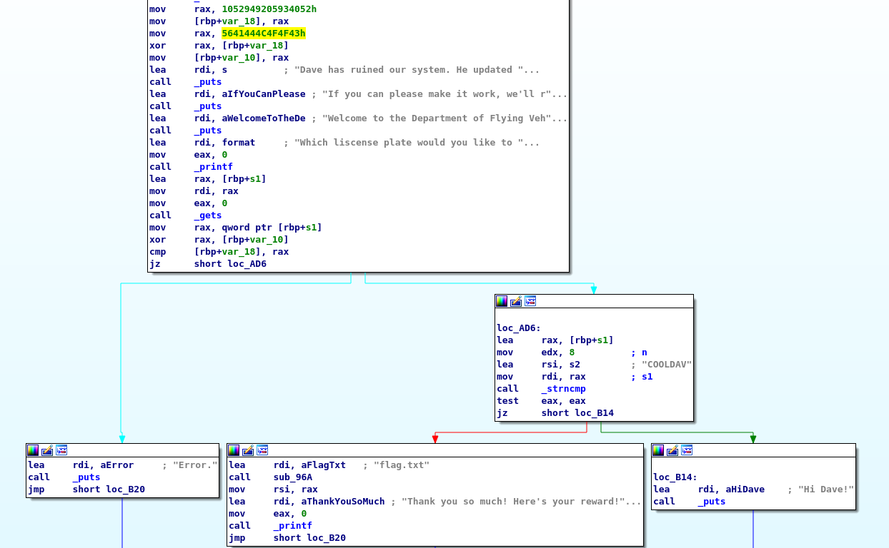

[](ctf=b01lers-ctf-2020)
[](type=pwn)
[](tags=buffer-overflow)
[](tools=ida)

# department of flying vehicles

We are given a [binary](../dfv) which has a buffer overflow due to a call to
`gets`.

The program reads user input and xors it with a key. It then compares that to
a hardcoded value.

Basically it does the following:

```python
xor_key = 0x1052949205934052
xor_value = 0x5641444C4F4F43 # hex for 'COOLDAV'
xor_result = xor_key ^ xor_value

s = gets() # buffer overflow here

if (s ^ xor_result != xor_value):
    # fail
else:
    # checks if the first 8 characters of our input are
    # 'COOLDAV\x00' using strncmp
    # if they aren't we get the flag!
```



Using the buffer overflow, we can modify the `xor_key`, `xor_value`, and
`xor_result` to make `strncmp` to fail and give us the flag.

Running the [solver script](./solve.py)

```sh
$ python solve.py
[+] Opening connection to pwn.ctf.b01lers.com on port 1001: Done
b"\nIf you can please make it work, we'll reward you!\n\nWelcome to the Department of Flying Vehicles.\nWhich liscense plate would you like to examine?\n > "
b"Thank you so much! Here's your reward!\npctf{sp4c3_l1n3s_R_sh0r7!}\n"
```
